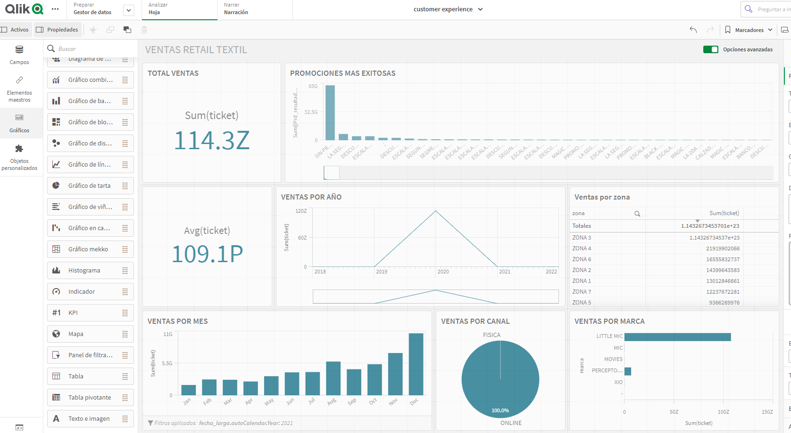

# ETL customer experience postgresql

This is a repository for extracting customer experience insights and BI of a textil retile company . The repository includes scripts for extracting the data ,preprocessing, treatment, bi tools for visualization and also machine learning The project is interactive through FastAPI and is documented in the FastAPI docs.

if you have comments or want to collaborate feel free to fork and make a PR :).

## Bigquery Datalake

## Visualization with QlinkSense

Bigquery live conection with database

## Installation

To use this repository, follow these steps:

1. Install Pipenv by running the command `pip install pipenv` in the terminal.
2. Clone this repository to your local machine.
3. Navigate to the repository folder in the terminal and run the command `pipenv install -r requirements.txt` to install the necessary dependencies.
4. Activate the virtual environment by running the command `pipenv shell` in the terminal.
5. Launch the FastAPI application by running the command `uvicorn app.main:app --reload`.

## Usage

Once the FastAPI application is running, you can access it through your web browser by navigating to `http://localhost:8000/docs`. This will bring up the interactive documentation for the application. You can use this interface to test out the various image processing and dimensionality reduction techniques that are implemented in the repository.

## Contributing

If you would like to contribute to this repository, feel free to fork the project and submit a pull request. We welcome contributions from the community and appreciate any help that we can get.

## License

This repository is licensed under the MIT License. See the `LICENSE` file for more details.
